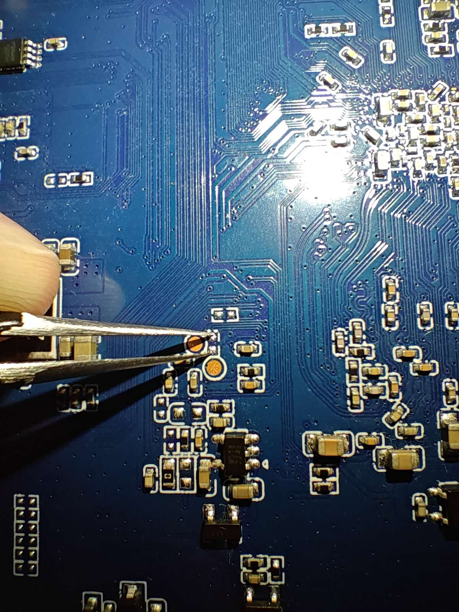

# 固件

# 硬件

亮钻K-A311D，Amlogic A311D SoC，4 GB DDR，32 GB eMMC，一个USB 2.0 Type-A，一个USB 3.2 Gen1 Type-A，千兆网口和AP6255 WiFi/BT

http://www.liontron.cn/showinfo-118-217-0.html

http://en.liontron.cn/showinfo-118-218-0.html

eMMC短接点



Micro USB用于在USB下载模式下传输数据

主板上的USB 2.0 Type-A为USB 2.0 Hub芯片扩展而来，而Hub芯片和主板上的Micro USB复用同一USB 2.0信号

USB信号复用芯片在Micro USB的上方，有4221的丝印。搜索4221 switch chip找到名为BCT4221A的芯片手册，量了下引脚，基本确定是该芯片。在该板子上，BCT4221A的使能引脚被短接到GND，即一直使能输出。只要切换S引脚的高低电平就能在Type-A和Micro USB之间切换输出。不去控制S引脚，USB信号默认连接到Micro USB

# PHY LED

该设备的RJ45接口上有两个LED，左边的黄灯（LED1），右边的绿灯（LED2）

可以使用[wkz/phytool](https://github.com/wkz/phytool)工具在用户空间来测试LED：

```
# 强制LED2常亮
phytool write end0/0/0x1e 0xb7 && phytool write end0/0/0x1f 0xe028

# 强制LED1常亮
phytool write end0/0/0x1e 0xb7 && phytool write end0/0/0x1f 0xe005

# 读出LED1的默认配置
phytool read end0/0/0x1f
0x0670

# LED1平时熄灭，有TX/RX流量时闪烁
phytool write end0/0/0x1e 0xb8 && phytool write end0/0/0x1f 0x2600

# 10/100/1000Mbps link时LED2常亮
phytool write end0/0/0x1e 0xb9 && phytool write end0/0/0x1f 0x0070
```

TODO: 在内核中完成PHY LED的配置
